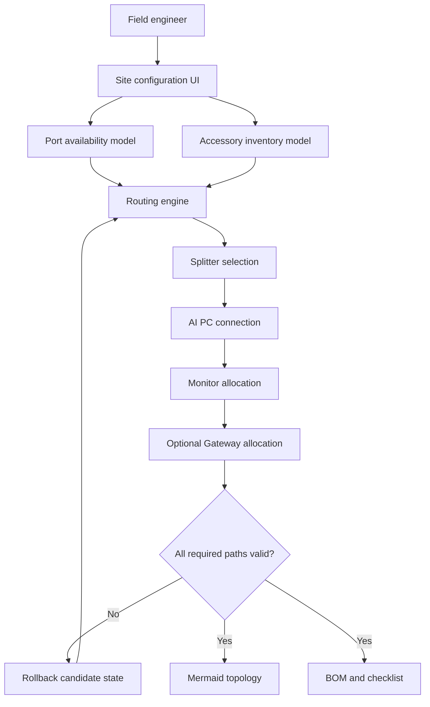

# Architecture

## Functional flow

## Core state

The routing engine tracks:

- remaining accessory inventory
- consumed-item BOM
- Mermaid graph source
- remaining AI-PC outputs
- defined graph nodes

A candidate route is evaluated against the current state. If a downstream connection becomes impossible, the previous state is restored and another candidate is tried.

## Routing layers

### Raw-video distribution

Select a splitter that supports the required number of raw-video branches.

### Endoscopy output normalization

Use direct cables or converter chains when the endoscopy output differs from the selected splitter format.

### AI processing PC input

Connect the raw feed to the selected AI-PC input with available materials.

### Monitor routing

In one-monitor mode, preserve both raw bypass and AI output through either an external switch or separate monitor inputs.

In two-monitor mode, allocate one monitor to AI video and one to raw video.

### Gateway routing

When enabled, Gateway input can originate from either AI output or raw video. Gateway output is then matched to a compatible monitor input.

## Production evolution

1. Move equipment and accessory definitions into versioned JSON.
2. Represent connectors and converters as a directed compatibility graph.
3. Use weighted path search to minimize adapters and signal degradation.
4. Add unit tests for verified equipment combinations.
5. Add offline-first PWA support.
6. Add signed installation worksheet export.
