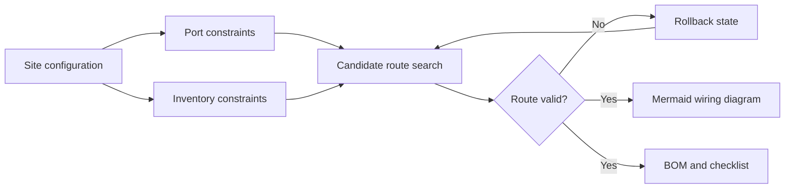

# EndoWire AI

Field Service Wiring Assistant for Endoscopy AI Systems

EndoWire AI is a browser-based field service decision support tool that generates an installable wiring path and a bill of materials from the actual equipment ports and accessories available at the installation site.

## Problem

Field installation becomes error-prone when site conditions vary:

- Endoscopy processor output: HDMI, DVI, SDI, YPbPr
- AI processing PC input: HDMI, DVI, SDI
- One-monitor fail-safe or two-monitor separated configuration
- Optional Gateway and Gateway monitor
- Monitor input-port availability
- Available splitters, switches, converters, and cables
- Need to preserve a raw-video bypass path when possible

## Solution

The application converts field conditions into constraints and then searches for a feasible route.

1. Build required video branches.
2. Select a usable splitter.
3. Connect raw video to the AI processing PC.
4. Allocate AI and raw-video paths to monitors.
5. Add Gateway routing when selected.
6. Consume accessories from entered inventory.
7. Roll back a candidate route if a downstream connection fails.
8. Render the validated topology as a Mermaid diagram.
9. Aggregate consumed items into a BOM and checklist.

## Key technical idea

This is a small constraint-based routing engine rather than a static wiring picture.

The route search snapshots inventory, BOM, graph state, remaining AI-PC outputs, and defined nodes. Failed candidate paths restore the previous state before another option is evaluated.

## Technology

- HTML5
- Vanilla JavaScript
- Tailwind CSS
- Mermaid 10
- Rule-based constraint search with rollback

## Demo

Open the interactive demo:

https://shaunsukgyukoh.github.io/projects/endoscopy-wiring-assistant/

## Portfolio positioning

This project demonstrates the ability to convert real field-service domain knowledge into reusable software logic. The key value is not the drawing itself. It is the encoding of compatibility rules, fail-safe requirements, inventory constraints, fallback routes, and installation outputs into an interface that a non-specialist field engineer can follow.

## Future roadmap

- Externalize routing rules into JSON
- Build equipment-model port database
- Add automated route tests
- Optimize by adapter count, cost, and signal quality
- Add saved site profiles
- Add printable installation sheet
- Add offline PWA mode

## Disclaimer

Portfolio demonstration only. The application does not process patient data or make clinical decisions. Equipment compatibility should be verified against official manuals and validated installation procedures.
